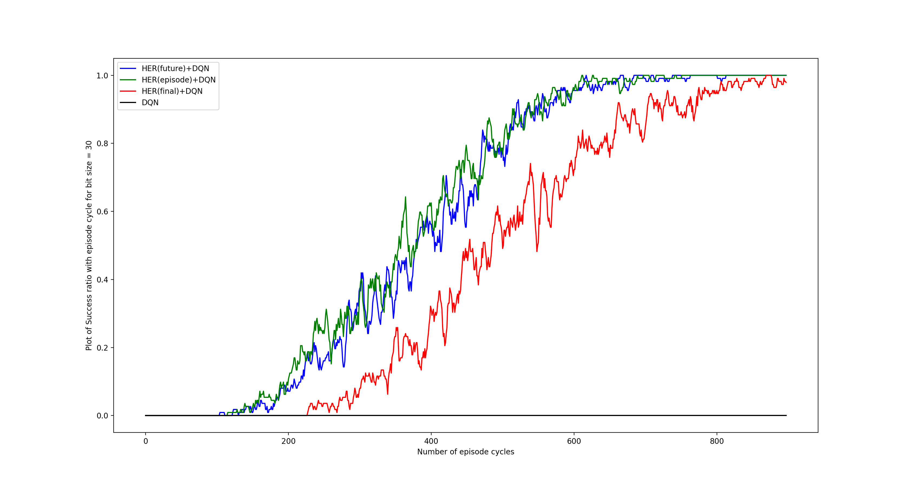

# Hindsight-Experience-Replay


### This is an implementation of the bit-flipping experiment mentioned in paper [Hindsight Experience Replay](https://arxiv.org/abs/1707.01495) arXiv preprint arXiv:1707.01495 (2017).

To start training, simply run :-
```
python her_main.py
```
The goal state can be chosen by 3 different strategies(final, future, episode) as mentioned in the paper.
To run with any strategy simply change the Her flag and run the code. For example, for the strategy 'final' simply run :-

```
python her_main.py --Her final
```
To get the results without using HER algorithm run :-
```
python her_main.py --Her None --bit_size 7
```


Below is the plot showing the comparison between HER+DQN and DQN for a bit size of 7.


However, for a bit size > 10 only using the DQN algorithm does not lead to any success.

Below is the plot comparing all the 3 different goal strategies as well as just DQN for a bit size of 30.



#### Acknowledgment
Code borrowed from [hindsight-experience-replay](https://github.com/minsangkim142/hindsight-experience-replay)
